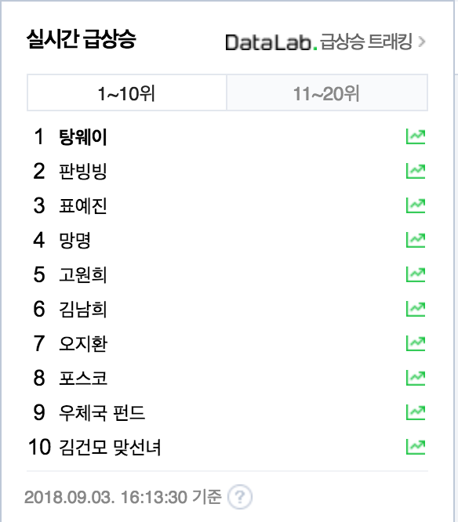

# KangisMarket

### Develop Diagram

--------

[Editor](https://mermaidjs.github.io/mermaid-live-editor/)
</img>

# Our goal pages

#### Main view

 	Kangis market에서 가장 중요한 View. 실제 물건이 거래되고 보여지는 페이지

 메인뷰는 가벼운 카드형식으로 예술품들을 소개 할 수 있도록 함 

단, UX 를 위해 클릭을 유도 할 수 있는 animation 필요

*benchmark* : [29cm site](www.29cm.co.kr)

#### 게시판 & 댓글 CURD

	각 미술품은 1명의 화가와 여러명의 유저, 만약 팔렸을때 구매자가 DB로 구현되어야 한다.

#### 졸업작품 전시회 일정 공유

​	Sub Service로써 유저들에게 각 대학의 졸업작품 전시회 일정 및 장소를 공유

#### 이시각 가장 핫한 미술품

​	각 게시글에 View를 Sorting하여 근 1시간 내에 가장 높은 조회수 등락을 확인 할 수있음

#### 각 미술품 게시글에는 ? 

​	댓글, 화가의 말, 조회수, 예술품 사진 이 들어가야 한다.

## Developer

seok and ki

### 